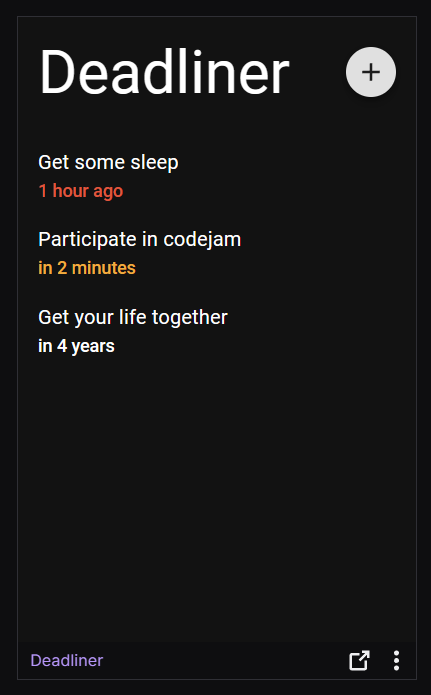
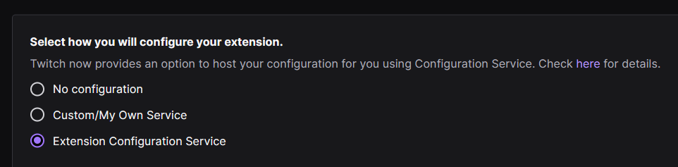
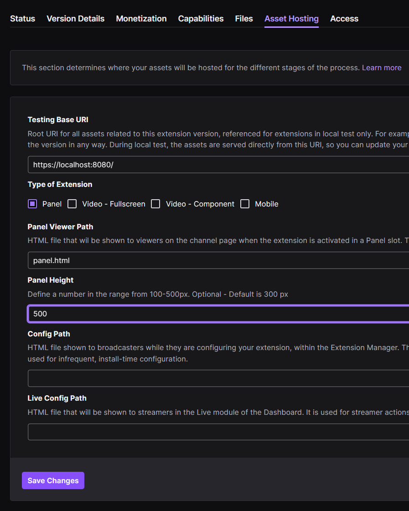

# Deadliner

Deadliner is Team TypeScript's entry into [TimeEnjoyed's codejam](https://codejam.timeenjoyed.dev/) in July 2023. The category was Twitch Integration, and the theme was Time.

Team TypeScript has two members:

- [Shivan Sivakumaran](https://github.com/shivan-s)
- [Ryan Braganza](https://github.com/ryanbraganza)

## What is Deadliner?

Deadliner is a Twitch Panel that can be viewed below a stream. The streamer can set deadlines, track them, and delete them. Everybody can view these deadlines to keep the streamer accountable.

## Features

- Add a deadline
- Delete a deadline
- Highlighting missed deadlines in red
- Highlighting nearby deadlines (within 24h) in orange
- Support for dark mode and light mode

## Technology

Deadliner is a [React](https://react.dev/) app, bundled with [Vite](https://vitejs.dev/), and authored with [TypeScript](https://www.typescriptlang.org/).

For components, it uses [Material UI](https://mui.com/material-ui/).

For persistence, it uses the [Twitch Extension Configuration Service](https://dev.twitch.tv/docs/extensions/building/#using-the-configuration-service)

## Quick start

Deadliner has been tested on Windows 10 and macOS.

After you've cloned the repository, you'll need to set up the following:

1.  [node](https://nodejs.org/) v18 or higher
1.  [npm](https://www.npmjs.com/) v8 or higher

Once you've got those prerequisites, run:

`npm install`

To start the app with an in-memory version of deadlines, run:

`npm run dev`

The first time you run this, you'll be prompted to install the generated self-signed certificate.

If you have permission errors, you can try `npm run dev:ryan` instead, which will store the certificate-related files in a directory local to the project.

Visit <https://localhost:8080> to explore the UI. The page will hot-reload as you make any edits in your editor.

## Testing with Twitch

When you're ready to proceed testing against a Twitch channel, head to <https://dev.twitch.tv/console/extensions> to create a new extension.

Name your extension, then tell Twitch it's a "Panel" extension.

Once your extension version has been created, proceed to add the "Extension Configuration Service" to its capabilities.

Continue to Asset Hosting, and increase the panel height to 500.

Once you've added saved your changes, go to your Twitch Dashboard (e.g. <https://dashboard.twitch.tv/u/YOUR_CHANNEL_NAME/extensions/inviteonly>) to add the extension to your channel.

Twitch will load the `/panel.html` file, which persists deadlines to the Twitch Extension Configuration Service that we enabled earlier.

## Releasing

1.  Run `npm run build`
1.  Create a `.zip` archive of the generated files in the `dist/` directory.
1.  Upload the `.zip` in the "Files" tab of your extension.
1.  Proceed to "hosted test".
1.  See [Extension life cycle](https://dev.twitch.tv/docs/extensions/life-cycle/#life-cycle-overview) for more details.
